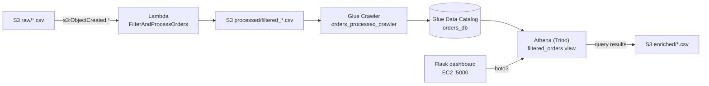
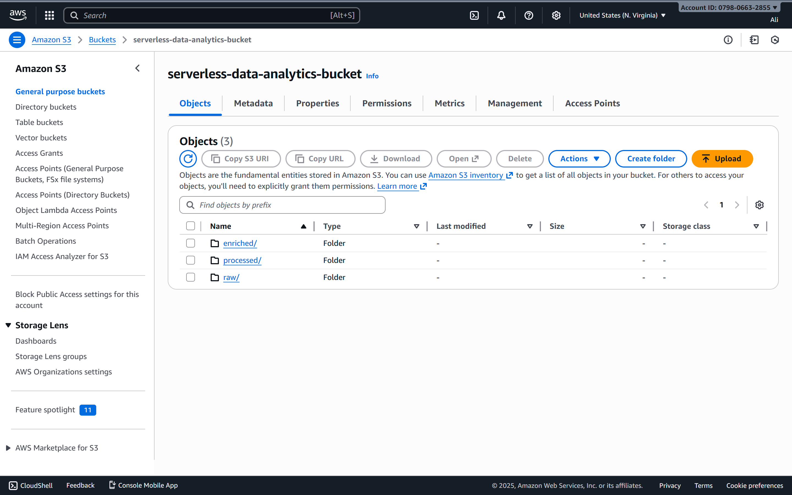
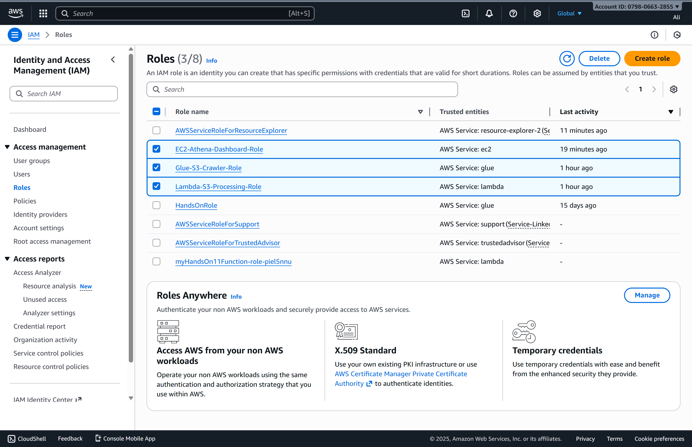
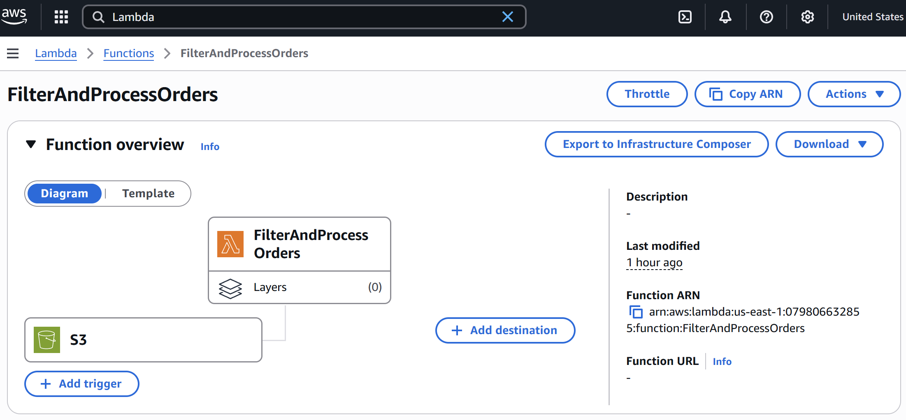
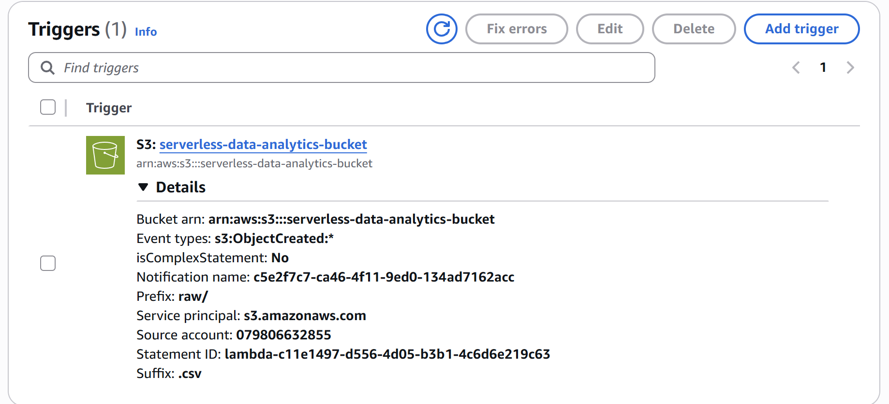
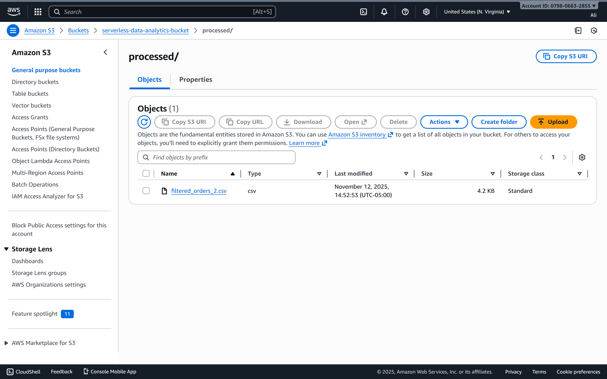
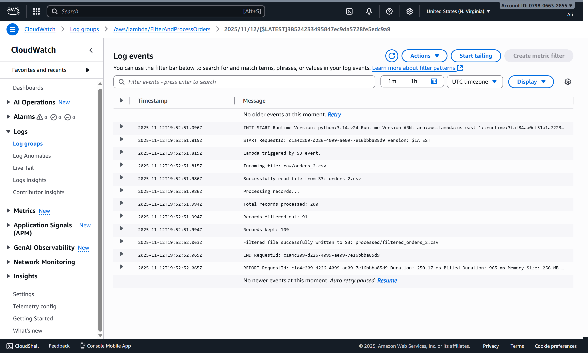
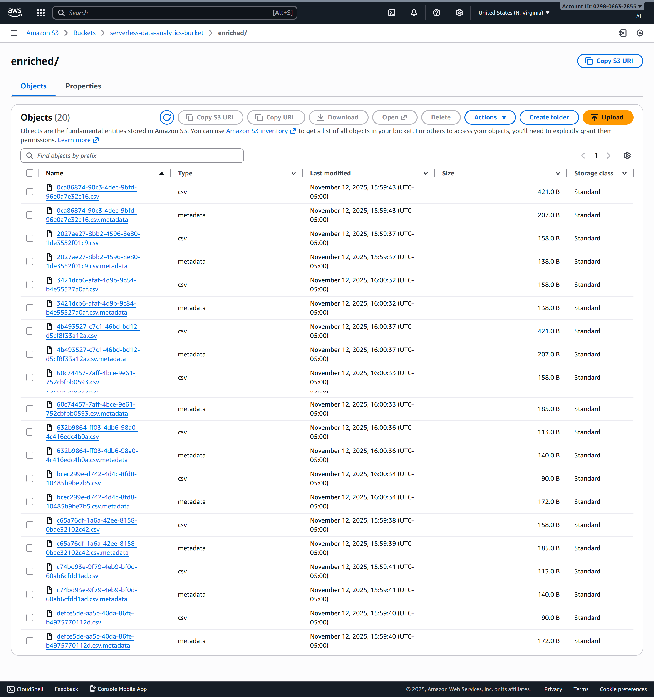
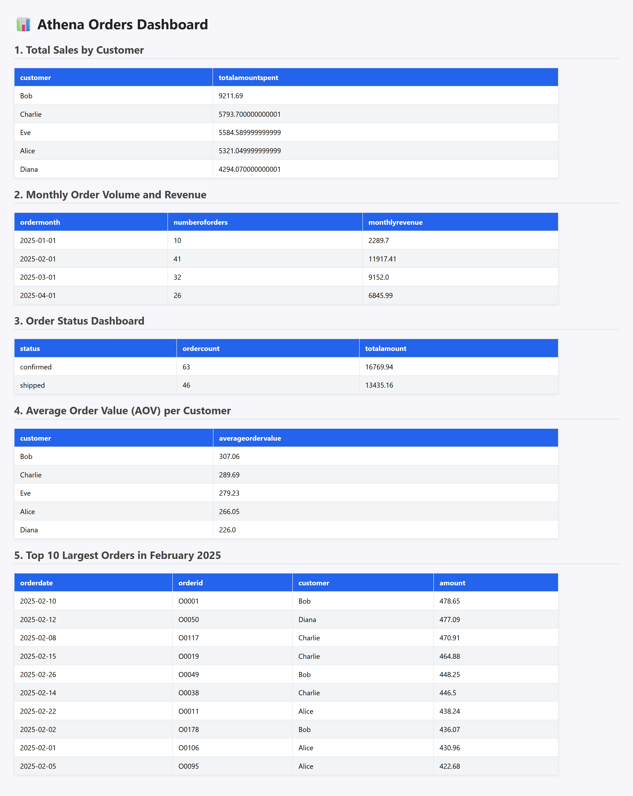

## Event-driven S3 → Lambda → Glue → Athena (Trino) ETL with a boto3/Flask dashboard on EC2

An event-driven ETL pipeline on AWS. When raw order CSVs land in Amazon S3, they trigger an AWS Lambda function that filters out stale records and writes cleaned output to a processed zone. An AWS Glue crawler infers the schema into the Glue Data Catalog. Amazon Athena (engine v3, built on Trino) then queries the data in place, and a Flask application on EC2 uses boto3 to run the analytical queries and render the results as a web dashboard.

Ingestion, transformation, cataloging, and querying are fully serverless. Only the presentation layer runs on provisioned compute.

---

## Architecture



| Layer | Service | Responsibility |
|---|---|---|
| Storage | Amazon S3 | Prefix-based zones: `raw/`, `processed/`, `enriched/` |
| Transform | AWS Lambda (Python 3.11) | Event-triggered filtering of incoming order files |
| Catalog | AWS Glue Crawler + Data Catalog | Schema inference and table metadata |
| Query | Amazon Athena (engine v3 / Trino) | Serverless SQL directly over S3 |
| Presentation | Flask + boto3 on EC2 (Amazon Linux 2023) | Web dashboard for the analytical queries |
| Access control | AWS IAM | A dedicated execution role per service |

### Design highlights

- **Event-driven ingestion.** Processing starts from an `s3:ObjectCreated:*` notification scoped to `raw/` with a `.csv` suffix filter. No scheduler or polling is involved.
- **Prefix-isolated zones.** Lambda reads from `raw/` and writes to `processed/`. The trigger is scoped to `raw/`, so the function's own output can never re-invoke it, which rules out a recursive invocation loop.
- **Schema-on-read.** There is no load step into a database. Glue infers the schema from the CSV headers, and Athena queries the files where they sit in S3.
- **Semantic view layer.** The `filtered_orders` view casts every column to an explicit type and normalizes `status` to lowercase. This decouples the analytical queries from the types the crawler happens to infer.
- **Credential-free presentation tier.** The dashboard authenticates through an EC2 instance profile, so no access keys are stored on the host.

---

## Repository Structure

```
event-driven-athena-etl/
├─ LambdaFunction.py         # Lambda handler: filters raw orders and writes to processed/
├─ EC2InstanceNANOapp.py     # Flask dashboard: runs the Athena queries via boto3
├─ orders.csv                # Sample input dataset
├─ README.md
└─ screenshots/
   ├─ 01-s3-structure.png
   ├─ 02-iam-roles.png
   ├─ 03-lambda-overview.png
   ├─ 04-lambda-trigger.png
   ├─ 05-processed-folder.png
   ├─ 06-glue-crawler-cloudwatch.png
   ├─ 07-athena-enriched.png
   └─ 08-final-webpage.png
```

## Resource Reference

| Resource | Value |
|---|---|
| Region | `us-east-1` |
| S3 bucket | `serverless-data-analytics-bucket` |
| Raw zone | `s3://serverless-data-analytics-bucket/raw/` |
| Processed zone | `s3://serverless-data-analytics-bucket/processed/` |
| Athena results | `s3://serverless-data-analytics-bucket/enriched/` |
| Lambda function | `FilterAndProcessOrders` |
| Glue crawler | `orders_processed_crawler` |
| Glue database | `orders_db` |
| Athena view | `orders_db.filtered_orders` |
| IAM roles | `Lambda-S3-Processing-Role`, `Glue-S3-Crawler-Role`, `EC2-Athena-Dashboard-Role` |

## Data Model

The sample dataset (`orders.csv`) contains one row per order:

| Column | Type (after view casting) | Description |
|---|---|---|
| `orderid` | `VARCHAR` | Order identifier |
| `customer` | `VARCHAR` | Customer name |
| `amount` | `DOUBLE` | Order value |
| `status` | `VARCHAR` (lowercased) | Order status, e.g. `pending`, `cancelled` |
| `orderdate` | `DATE` | Order date, ISO 8601 (`YYYY-MM-DD`) |

---

## Prerequisites

- An AWS account with permission to create S3, IAM, Lambda, Glue, Athena, and EC2 resources
- AWS CLI v2 configured for `us-east-1`
- An EC2 key pair for SSH access

---

## Deployment

### 1. Create the S3 bucket and zones

S3 bucket names are globally unique. If `serverless-data-analytics-bucket` is taken, choose another name and substitute it throughout.

```bash
aws s3 mb s3://serverless-data-analytics-bucket --region us-east-1
for prefix in raw processed enriched; do
  aws s3api put-object --bucket serverless-data-analytics-bucket --key "${prefix}/"
done
```


*Bucket root with the `raw/`, `processed/`, and `enriched/` zones.*

### 2. Create the IAM roles

| Role | Trusted entity | Managed policies |
|---|---|---|
| `Lambda-S3-Processing-Role` | `lambda.amazonaws.com` | `AWSLambdaBasicExecutionRole`, `AmazonS3FullAccess` |
| `Glue-S3-Crawler-Role` | `glue.amazonaws.com` | `AWSGlueServiceRole`, `AmazonS3FullAccess`, `AWSGlueConsoleFullAccess` |
| `EC2-Athena-Dashboard-Role` | `ec2.amazonaws.com` | `AmazonAthenaFullAccess`, `AmazonS3FullAccess` |

These broad managed policies keep the demo simple. See [Security and Production Considerations](#security-and-production-considerations) for how to scope them down.


*The three service roles.*

### 3. Deploy the Lambda function

| Setting | Value |
|---|---|
| Function name | `FilterAndProcessOrders` |
| Runtime | Python 3.11 (3.9 and 3.10 also supported) |
| Execution role | `Lambda-S3-Processing-Role` |
| Handler code | Contents of `LambdaFunction.py` |

The function reads each newly created object in `raw/` and removes orders with status `pending` or `cancelled` that are more than 30 days old. It writes the result to `processed/` as `filtered_*.csv`.


*Function overview showing name and runtime.*

#### 3.1 Configure the S3 event trigger

| Setting | Value |
|---|---|
| Source bucket | `serverless-data-analytics-bucket` |
| Event type | All object create events (`s3:ObjectCreated:*`) |
| Prefix | `raw/` |
| Suffix | `.csv` |


*S3 trigger scoped to `raw/*.csv`.*

### 4. Ingest data

Create the trigger **before** uploading data. S3 event notifications apply only to objects created after the trigger exists.

```bash
aws s3 cp orders.csv s3://serverless-data-analytics-bucket/raw/orders.csv
```

Check that the filtered output was written and inspect the invocation logs:

```bash
aws s3 ls s3://serverless-data-analytics-bucket/processed/
aws logs tail /aws/lambda/FilterAndProcessOrders --since 10m
```


*`processed/` containing the filtered CSV.*

### 5. Catalog the processed zone with AWS Glue

| Setting | Value |
|---|---|
| Database | `orders_db` |
| Crawler | `orders_processed_crawler` |
| Data source | `s3://serverless-data-analytics-bucket/processed/` |
| IAM role | `Glue-S3-Crawler-Role` |
| Target database | `orders_db` |

Run the crawler, then confirm the table it created:

```bash
aws glue start-crawler --name orders_processed_crawler
aws glue get-tables --database-name orders_db --query "TableList[].Name"
```

The crawler names the table after the crawled prefix, which is typically `processed`. The table should expose `orderid`, `customer`, `amount`, `status`, and `orderdate`.


*CloudWatch logs for a successful crawler run.*

### 6. Query with Amazon Athena (Trino)

| Setting | Value |
|---|---|
| Data source | `AwsDataCatalog` |
| Database | `orders_db` |
| Query result location | `s3://serverless-data-analytics-bucket/enriched/` |

#### 6.1 Create the semantic view

Replace `processed` below if your crawler generated a different table name.

```sql
CREATE OR REPLACE VIEW orders_db.filtered_orders AS
SELECT
  CAST(orderid   AS VARCHAR)      AS orderid,
  CAST(customer  AS VARCHAR)      AS customer,
  CAST(amount    AS DOUBLE)       AS amount,
  LOWER(CAST(status AS VARCHAR))  AS status,
  CAST(orderdate AS DATE)         AS orderdate
FROM orders_db."processed";
```

#### 6.2 Analytical queries

Each execution writes `<QueryExecutionId>.csv` and a matching `.csv.metadata` file to `enriched/`.

**Total sales by customer**
```sql
SELECT customer, SUM(amount) AS totalamountspent
FROM orders_db.filtered_orders
GROUP BY customer
ORDER BY totalamountspent DESC;
```

**Monthly order volume and revenue**
```sql
SELECT date_trunc('month', orderdate) AS ordermonth,
       COUNT(orderid)                 AS numberoforders,
       ROUND(SUM(amount), 2)          AS monthlyrevenue
FROM orders_db.filtered_orders
GROUP BY 1
ORDER BY ordermonth;
```

**Order status breakdown**
```sql
SELECT status,
       COUNT(orderid)        AS ordercount,
       ROUND(SUM(amount), 2) AS totalamount
FROM orders_db.filtered_orders
GROUP BY status;
```

**Average order value (AOV) per customer**
```sql
SELECT customer, ROUND(AVG(amount), 2) AS averageordervalue
FROM orders_db.filtered_orders
GROUP BY customer
ORDER BY averageordervalue DESC;
```

**Top 10 largest orders in February 2025**
```sql
SELECT orderdate, orderid, customer, amount
FROM orders_db.filtered_orders
WHERE orderdate >= DATE '2025-02-01'
  AND orderdate <  DATE '2025-03-01'
ORDER BY amount DESC
LIMIT 10;
```

The half-open date range covers the whole month without hardcoding its last day.


*`enriched/` containing Athena result sets.*

### 7. Deploy the Flask dashboard on EC2

| Setting | Value |
|---|---|
| AMI | Amazon Linux 2023 |
| Instance type | `t2.micro` |
| IAM instance profile | `EC2-Athena-Dashboard-Role` |
| Inbound rule: SSH | TCP `22` from your IP |
| Inbound rule: app | TCP `5000` from `0.0.0.0/0` (restrict for anything beyond a demo) |

Copy the application to the instance and install its dependencies:

```bash
# from your machine
scp -i <key>.pem EC2InstanceNANOapp.py ec2-user@<EC2_PUBLIC_IP>:~/app.py
ssh -i <key>.pem ec2-user@<EC2_PUBLIC_IP>

# on the instance
sudo dnf update -y
sudo dnf install -y python3-pip
pip3 install --user flask boto3
```

Set the configuration constants in `app.py`:

```python
AWS_REGION = "us-east-1"
ATHENA_DATABASE = "orders_db"
S3_OUTPUT_LOCATION = "s3://serverless-data-analytics-bucket/enriched/"
```

Start the server. The app binds to `0.0.0.0:5000`.

```bash
python3 app.py
# or keep it running after you disconnect:
nohup python3 app.py > app.log 2>&1 &
```

Open `http://<EC2_PUBLIC_IP>:5000`.


*Dashboard rendering the results of the five analytical queries.*

---

## Troubleshooting

| Symptom | Likely cause | Resolution |
|---|---|---|
| Lambda never runs | Trigger missing or misconfigured | Verify the bucket, `raw/` prefix, and `.csv` suffix on the trigger |
| Earlier uploads never processed | S3 events don't fire for objects that existed before the trigger | Re-upload the file, or copy it under a new key in `raw/` |
| No file in `processed/` | Handler error | Run `aws logs tail /aws/lambda/FilterAndProcessOrders` |
| Crawler fails | Role or data issue | Confirm `Glue-S3-Crawler-Role` and that `processed/` holds CSVs with a header row |
| Crawler creates several tables | Files in `processed/` have different schemas | Keep one consistent schema per prefix |
| `CAST(orderdate AS DATE)` fails | Dates not in ISO format | Make sure `orderdate` is `YYYY-MM-DD`, or parse it with `date_parse` |
| Athena: table or view not found | Wrong database or table name | Check `orders_db`, the crawler's table name, and that `filtered_orders` exists |
| Athena: no output location | Results location not set | Set the query result location to `enriched/` in the workgroup settings |
| Port 5000 unreachable | Security group or bind address | Open TCP 5000 in the security group and bind Flask to `0.0.0.0` |

---

## Security and Production Considerations

This project is set up as a demo. Before running anything like it in production:

- **Least privilege.** Replace `AmazonS3FullAccess` with inline policies scoped to the bucket and to the prefixes each role actually uses. For example, Lambda only needs to read `raw/*` and write `processed/*`. `AWSGlueConsoleFullAccess` is designed for console users and is usually unnecessary for a crawler's service role.
- **Network exposure.** Restrict port 5000 to known IPs, or serve the app through a WSGI server (e.g. Gunicorn) behind Nginx or an Application Load Balancer. The Flask development server is not meant for production traffic.
- **Stable endpoint.** An EC2 public IP changes when the instance stops and starts. Attach an Elastic IP or put a DNS name in front of it.
- **Catalog freshness.** Schedule the crawler, or trigger it after Lambda writes, so new schemas and partitions are registered automatically.
- **Query cost.** Athena charges by data scanned. At larger volumes, write Parquet to `processed/` and partition by date.

## Cleanup

To avoid ongoing charges, remove these resources when you're done: terminate the EC2 instance, delete the Lambda function and its S3 trigger, delete the Glue crawler and the `orders_db` database, empty and delete the S3 bucket, and remove the three IAM roles.
